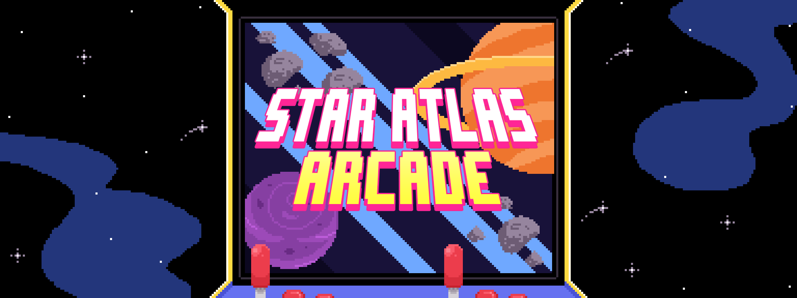

# star-atlas-arcade

Welcome to the Star Atlas Arcade. Built for the 2021 Solana hackathon, this is a collection of community-created minigames based on the Solana blockchain protocol.

### Our Vision

Star Atlas is excited to contribute to the growth of blockchain mechanics in the video game industry. Our vision is for the Arcade to grow over the years to showcase and promote community projects which promote the use of next-generation tech in the gaming space.

## Contributing

### Rules

1. Prizes are unique and may only be distributed once
2. Awards are non-unique and may be distributed multiple times
3. A given entry can win at most one prize, but can win multiple awards of different categories
4. It is not necessary to win a prize to be eligible for rewards
5. All entries must be be a game or involve game mechanics to qualify

### What do I get?

Star Atlas is sponsoring a total pool of **$25,000** split between prizes and awards to contestants who enter their programs into the Arcade.

In addition, all current and future winners (of both prizes and awards) will be permanently hosted by Star Atlas at [https://arcade.staratlas.com](https://arcade.staratlas.com). 

#### Prizes

| Prize                  | Value   |
|------------------------|---------|
| Best Overall           | $10,000 |
| Second Place           | $5,000  |
| Third Place            | $3,000  |

#### Awards

There is a total prize pool of **$7,000** for awards. Unlike prizes, individual awards may be distributed multiple times at the discretion of judges.

| Award          | Value  | Description |
|----------------|--------|-------------|
| Best UI / UX   | $1,000 |             |
| TODO           | $1,000 |             |
| TODO           | $1,000 |             |
| Judge's choice | $1,000 |             |

### How does it work?

1. Build your project
2. Open a pull request against this repository
    - See CONTRIBUTING.md for more details
    - Include any relevant environment variables or constraints required for your project to run
3. When the hackathon ends, we'll announce winners and distribute the prize pool accordingly

Happy hacking!

## About Star Atlas

At star atlas, we're creating an immense space exploration and territorial conquest MMO.

Core game mechanics include:

1. Grand strategy on a massive level, in a constantly expanding universe
2. Space exploration, mining, and territory control
3. Galactic, real-time battle scenarios and missions in PVP and PVE
4. Asset-based skill level system

> We're hiring! If you're a Solana, web, or Unreal developer interested in joining our project, send a resume to `careers@staratlas.com` and let's chat.

To learn more about us, check out our [white paper](https://staratlas.com/files/star-atlas-white-paper.pdf) or work in progress [browser minigame](https://play.staratlas.com).
